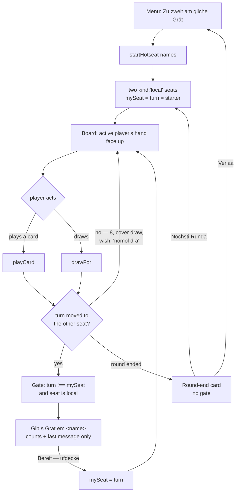
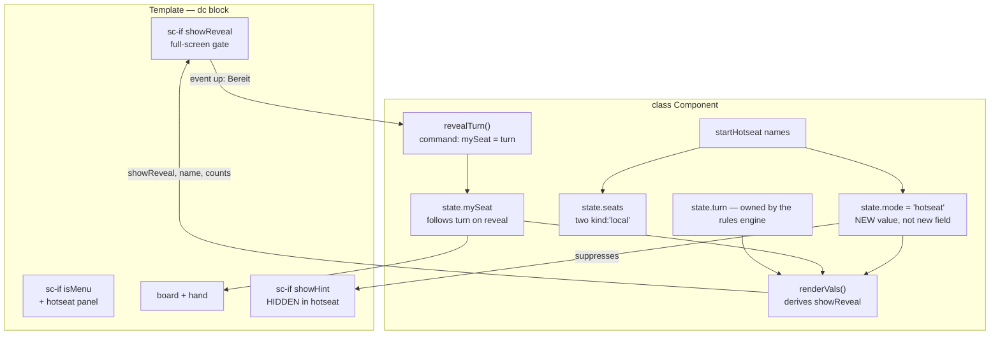

# Flow: local hotseat multiplayer

Issue: [#2](https://github.com/freaxnx01/game-tschau-sepp/issues/2)
Phase 2 of the UI workflow. Approved 2026-09-14.
Wireframe: [wireframe.md](wireframe.md)

## Diagram 1 — User journey



## Diagram 2 — Component and state map



## `showReveal` is derived, not stored

```text
mode === 'hotseat'  &&  phase === 'play'  &&  !roundEnd
                    &&  turn !== mySeat
                    &&  seats[turn].kind === 'local'
```

That single expression covers every row of the wireframe's state table without
special-casing:

- **8 / cover-draw / "nomol dra"** set `turn` to the *same* seat, so
  `turn === mySeat` and no gate appears.
- **`phase === 'wish'`** (Under played) leaves `turn` unchanged, so the wisher
  keeps the screen to pick a suit.
- **Round end** is excluded by `!roundEnd`.
- **Bot and P2P games** never match — `mode` is `'bot'` / `'host'` / `'guest'`.

**Ownership:** the rules engine keeps owning `turn` and is untouched. `mySeat`
becomes a *view* concern — which seat the screen currently shows — advanced only
by `revealTurn()`. No `pendingReveal` flag, no timer, nothing to desynchronise.

No services, no API calls, no async, no persistence.

## Screen inventory

No screens beyond the three in the wireframe. Four implied behaviours, flagged
rather than left to be discovered during build:

- **"Tschau!" belongs to the active player.** It already keys off `mySeat`, so
  it follows the gate correctly — meaning a player must say Tschau *before*
  handing over. That is the correct rule; it gets a deliberate test.
- **`sndRound()` compares `winner === mySeat`** to choose the win/lose jingle.
  Still works with a moving `mySeat`, but "lose" plays for whoever holds the
  device. Minor, noted.
- **Bubbles and toasts key off `mySeat`.** They fire for the active player,
  which is right; any firing after the turn moves land behind the gate, so they
  are invisible rather than leaky.
- **`myName` / `myNameCustom` are P2P-specific.** Hotseat names go in
  `seats[i].name`, which already exists and is already rendered in the topbar.
