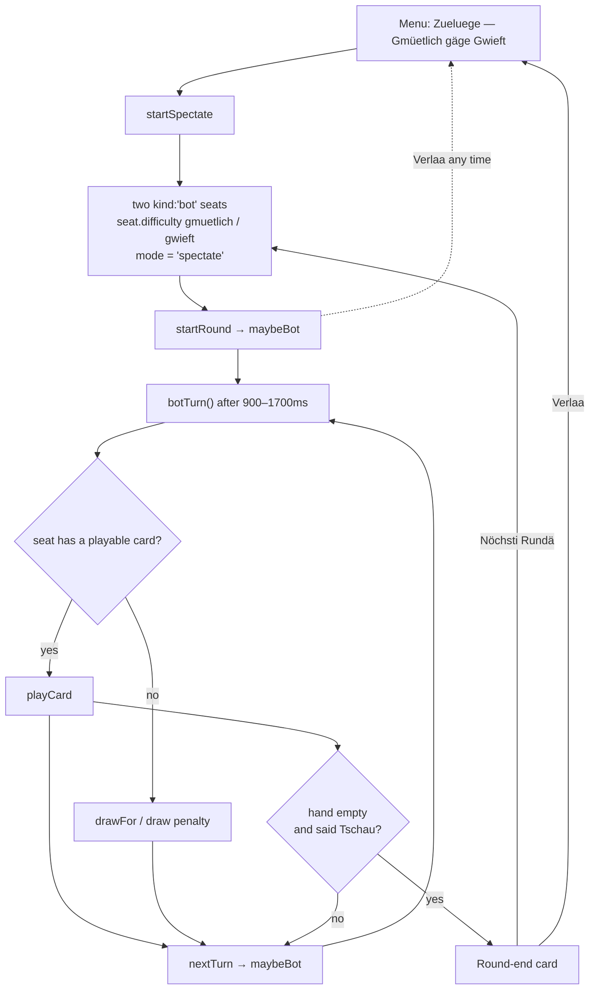
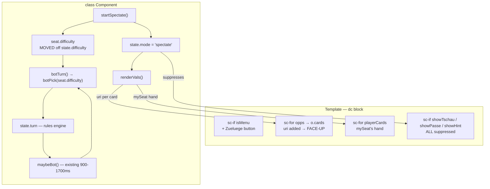

# Flow: CPU vs CPU spectator mode

Issue: [#1](https://github.com/freaxnx01/game-tschau-sepp/issues/1)
Phase 2 of the UI workflow. Approved 2026-09-17.
Wireframe: [wireframe.md](wireframe.md)

## Diagram 1 — User journey

The loop is entirely `maybeBot` → `botTurn` → `nextTurn` → `maybeBot`. **The
human never appears in it** — the only human actions are leaving and advancing
to the next round.

## Diagram 2 — Component and state map

**Ownership:** unchanged. The rules engine owns `turn`; `maybeBot`/`botTurn`
already drive play. The only genuine move is `difficulty` from global state onto
the seat.

No services, no API calls, no async beyond the existing timer, no persistence.

## The difficulty refactor, precisely

`s.difficulty` is read in exactly two places, both of which already know which
seat is acting:

| site | today | after |
|---|---|---|
| `botPick()` | `s.difficulty === 'gmuetlich'` | `seats[me].difficulty === 'gmuetlich'` |
| "forgets Tschau" roll | `s.difficulty === 'gmuetlich'` | `seats[who].difficulty === 'gmuetlich'` |

`start(diff)` writes `difficulty` onto the bot seat as well, so solo games keep
behaving identically.

**Corrected during the build:** this section originally said `state.difficulty`
would be *removed*. It is kept. `scripts/sim/harness.mjs:147` sets only the
global field and builds its seats without a `difficulty`, so reading solely from
the seat would have routed every harness game down the `gwieft` path and
silently destroyed all gmüetlich coverage — with no test going red. Instead
there is one read path, `seatDifficulty(i)`, with explicit precedence: the seat
wins, the global field is the fallback.

## Screen inventory

No new screens. Four implied behaviours, flagged rather than left for the build:

- **`showTschau` and `showPasse` must be suppressed**, not only `showHint`. Both
  key off `mySeat`, which now points at a bot seat, so a stray clickable
  "Tschau!" could appear for a hand the human does not control.
- **`tryPlay()`, `drawClick()`, `sayTschau()` and `passTurn()` must all refuse
  in spectate mode.** The flow originally named only `tryPlay`; the draw pile's
  click handler is always mounted, so clicking it would have drawn *for* the
  bot. The hand renders face-up with
  `pick` handlers attached; without a guard a click would let the human play
  *for* the bot. "Nothing is clickable" has to be enforced in the command, not
  merely hidden in the view.
- **`toastDraw`/`bubble` key off `mySeat`**, so the top bot's draws show no
  toast. Acceptable asymmetry for a demo; noted, not fixed.
- **`sndRound()` compares `winner === mySeat`**, so the win/lose jingle is
  arbitrary here — the same pre-existing wart already noted for hotseat.
