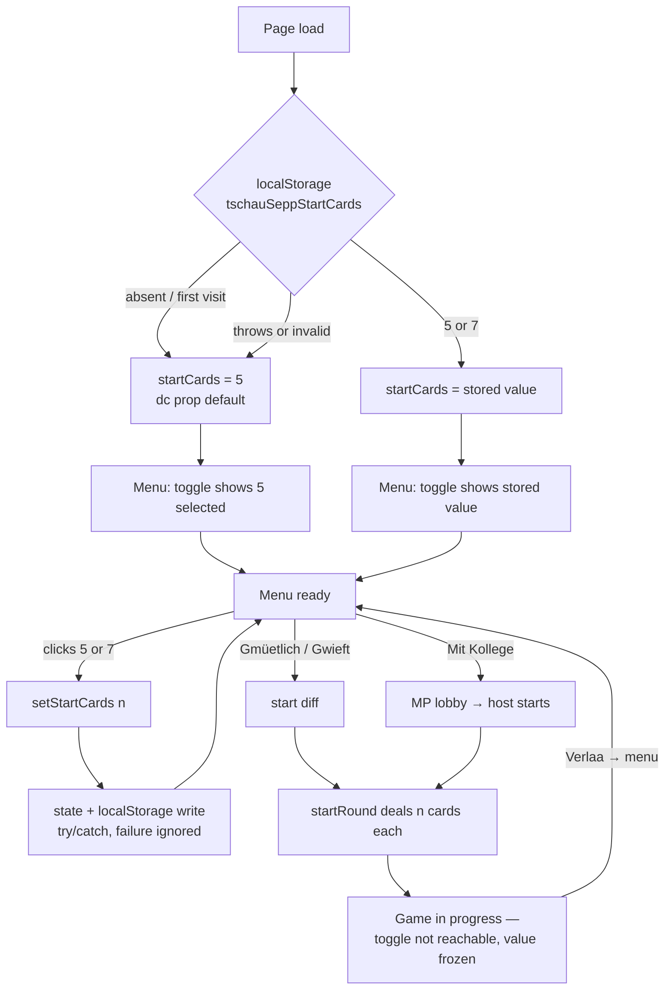
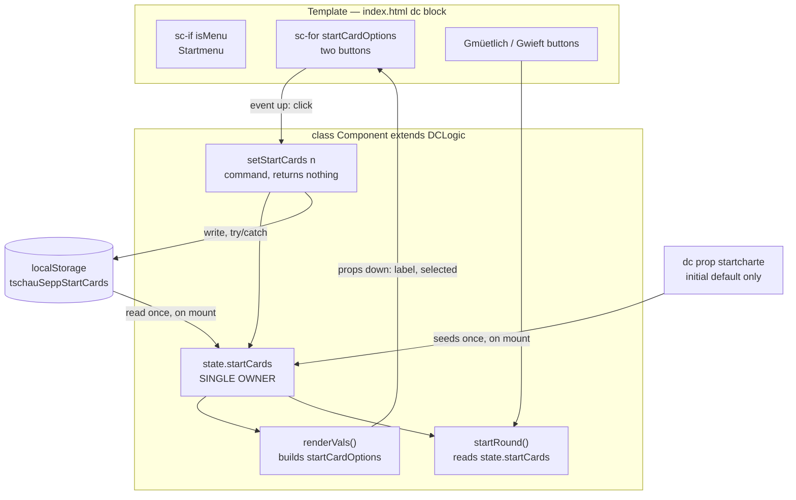

# Flow: choose the number of starting cards

Issue: [#7](https://github.com/freaxnx01/game-tschau-sepp/issues/7)
Phase 2 of the UI workflow. Approved 2026-09-10.
Wireframe: [wireframe.md](wireframe.md)

## Diagram 1 — User journey

## Diagram 2 — Component and state map

This stack has **no framework and no component library**: one
`Component extends DCLogic` owns everything, with `<sc-if>` / `<sc-for>`
template regions rather than child components. Mapped as it actually is:

**Ownership:** `state.startCards` is the single source of truth. `localStorage`
is a mirror for the next visit, never read during play; the dc prop seeds only
the first load. This keeps the stack rule that a render function reads state and
never mutates it, and that input handlers write state and never draw.

**No services, no API calls, no async.** Nothing to inject, nothing to fail over.

## Screen inventory

No new screens or dialogs. Two implied gaps, surfaced rather than skipped:

- **The MP lobby shows no card count.** Placement is start-menu-only, so a guest
  joining a host's game cannot see how many cards they will be dealt until the
  round begins. Not a blocker — it is obvious once dealt — but it is a real
  information gap created by that decision. Revisit if guests ask.
- **`startRound()` is also called on "Nöchsti Rundä"**, not only from the menu.
  The count must stay frozen for a whole match. Nothing can change
  `state.startCards` while `phase !== 'menu'`, so this holds by construction —
  but it gets an explicit test rather than being trusted.
